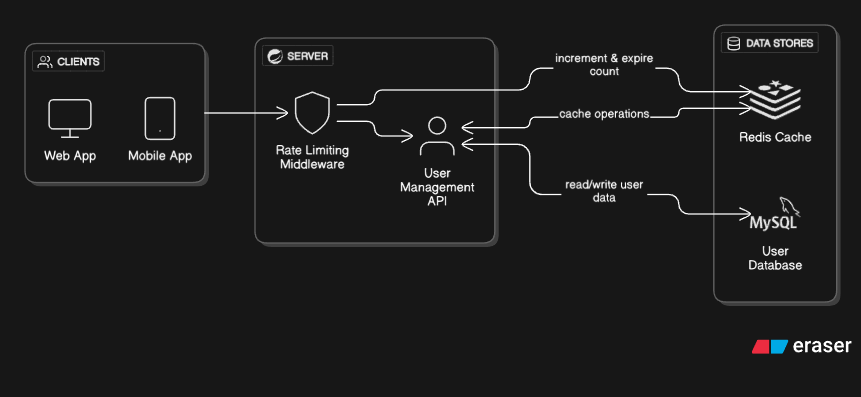

A simple rest api which uses the benefits of redis.
    ->Implements caching with help of spring cache dependency and redis
    ->Implements rate limiter by storing client ip address in redis db and by limiting the no of req to 5 for a minute

